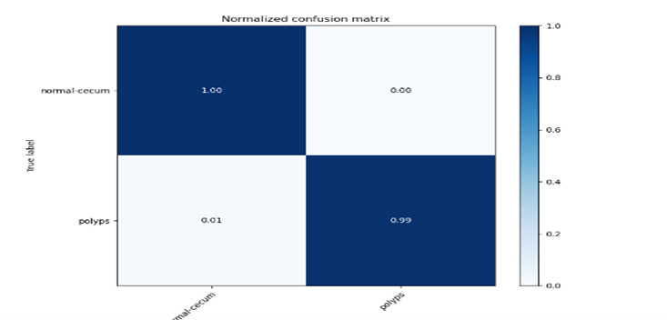
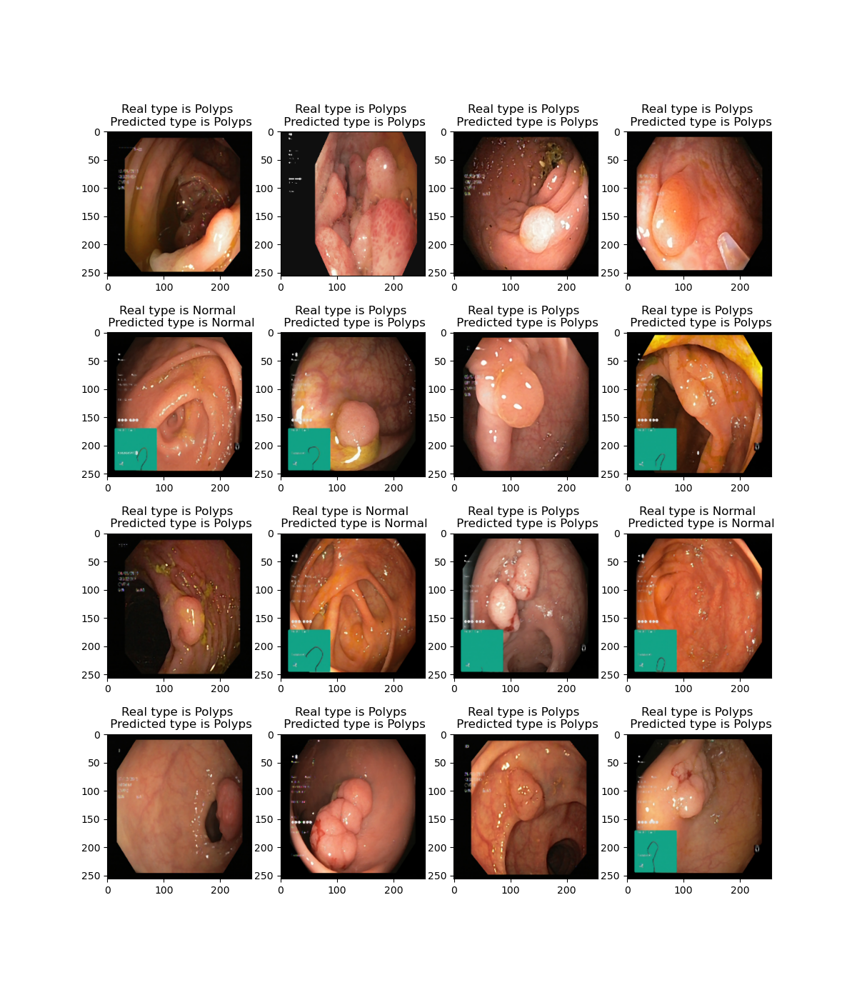
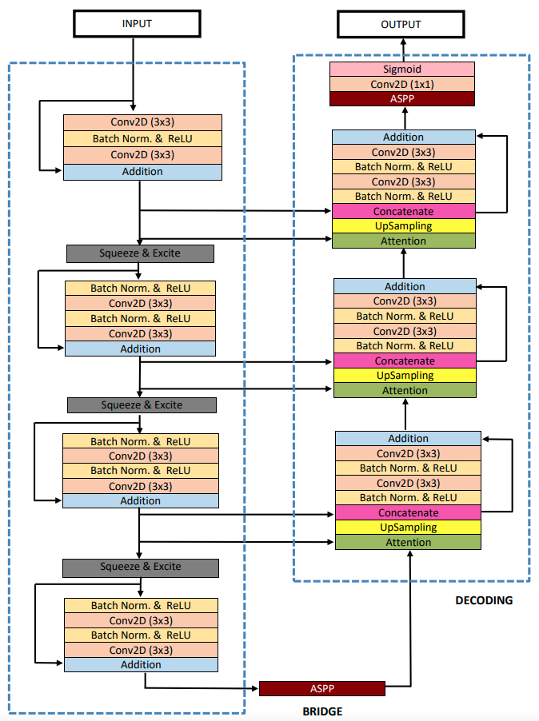
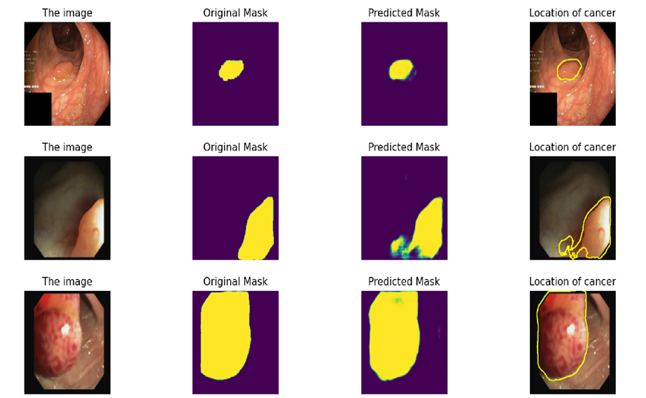

# Early Detection Of Colon Cancer
> Our problem was to develop an early detection system for colon cancer using classification and segmentation techniques, specifically semantic segmentation to identify and analyze suspicious regions of the colon which will help in solving the high incidence and mortality rates of colon cancer, which is one of the most common types of cancer worldwide.
> 
> Our data collection, consisting of the Kvasir and CVC-612 datasets, has enabled us to develop highly accurate models to solve the classification and segmentation problems in colon cancer detection.
> 
> In the modeling phase, the data is preprocessed, augmented, cleaned, and transformed to be used as input for the model. After completing the modeling phase, we
implemented both VGG16 and Resnet50 models to detect if the input image is normal or polyp, achieving an impressive accuracy rate of 99.5%.
>
> We adjusted resnet50 by adding batch normalization and a fully connected layer.
>
> Here is the Confusion matrix:
> 
> 
>
> Here is an example of the prediction of the  classification:
> 
> 
> 
> In the second sub-phase of implementation, we tackled the segmentation problem to locate the tumor by developing U-net, Res-Unet, and ResUnet++ models, which allowed us to reach the full potential of our models with a mean IoU of 91% and a dice coefficient of 95%.
>
> Here is the structure of Res-Unet++:
> 
> 
> 
> Our results demonstrate the strength and effectiveness of our approach, and pave the way for further advancements in early detection and treatment of colon cancer.
>
> Here is an example of the prediction of the  segmentation:
> 
> 
> 
> By adhering to the highest coding standards and leveraging state-of-the-art techniques for analyzing and designing system components, we have created a website interface that is incredibly scalable, maintainable, and reliable. Our website simplifies the process of dealing with our full pipeline, making it easier for doctors to analyze and diagnose potential cases of colon cancer.
> 
> Our unwavering commitment to excellence ensures that our website is a robust, user-friendly, and indispensable tool for healthcare professionals around the world.
>
> #### To take a look at the website click this link: https://youtu.be/IbeIIlpm8VA
> 
> #### Contact us ----> amr.yehiaz100@gmail.com | yomnafarid2001@gmail.com | gamalhanafi26@gmail.com | mahmoudkhaled225@gmail.com | mohamedramdan10.2001@gmail.com
